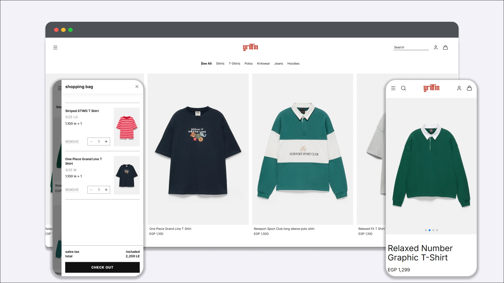

# Griffin

> A modern e-commerce experience for a premium men's streetwear brand.

[Live Demo](https://griffin-store.vercel.app/) · [GitHub](https://github.com/khaled-hassan7/griffin)


## Overview

Griffin is a full-featured e-commerce concept for a premium men's streetwear brand, built to explore modern front-end architecture, responsive UI design, and real-world shopping functionality — not just a static mockup.

The project pairs a clean, editorial visual language (gothic wordmark, black-and-white street photography, red accent color) with a fully functional shopping flow: product browsing, cart management, checkout, and order creation backed by a real database (Supabase). The goal was to treat it less like a portfolio mockup and more like a production-ready storefront — from empty states and loading skeletons to responsive breakpoints and micro-interactions.

**Why it's different from a typical e-commerce clone:**

- Real persisted order data via Supabase rather than mocked order submission
- Domain-based architecture with components organized by domain (cart, checkout, products, home) and colocated logic
- Editorial-first visual direction instead of a generic e-commerce template

## Design

### Homepage


The homepage combines full-bleed editorial photography with the brand's gothic wordmark to set an authentic streetwear tone before the user ever sees a product grid. Desktop and mobile layouts are shown side by side above, highlighting how the hero, navigation, and editorial story module ("The Language of the Street") adapt across breakpoints.

### Shopping Experience



The product grid, product detail view, and shopping bag share a consistent visual rhythm. The cart drawer supports quantity adjustment and removal without leaving the current page, and the mobile product page uses a swipeable image carousel to keep the experience native-feeling on small screens.

## Features

- Responsive design across mobile, tablet, and desktop
- Product browsing and filtering by category (Shirts, T-Shirts, Polos, Knitwear, Jeans, Hoodies)
- Product detail pages with size selection
- Cart management (add, update quantity, remove) — stored in client-side state via Zustand
- Multi-step checkout flow
- Shipping information capture
- Payment method selection
- Order creation and persistence in Supabase
- Product and order data integration with Supabase
- Responsive navigation with mobile drawer menu
- Editorial content sections
- Motion and micro-interactions throughout the UI

## Tech Stack

| Category           | Technology                                   |
| ------------------ | -------------------------------------------- |
| Framework          | [Next.js](https://nextjs.org/)               |
| UI Library         | [React](https://react.dev/)                  |
| Styling            | [Tailwind CSS](https://tailwindcss.com/)     |
| State Management   | [Zustand](https://github.com/pmndrs/zustand) |
| Backend / Database | [Supabase](https://supabase.com/)            |
| Data Fetching      | [React Query](https://tanstack.com/query)    |
| Animation          | [Motion](https://motion.dev/)                |
| Icons              | [Lucide React](https://lucide.dev/)          |

## Architecture

The project uses the **Next.js App Router** with route groups to separate major sections (home, shop, checkout), while UI components are organized **by domain** (cart, checkout, products, home, navigation) rather than dumped into a single flat folder. Each domain folder holds its own components and, where needed, its own Zustand store (e.g. `CartStore.js`, `CheckoutStore.js`), keeping state close to the UI that uses it.

```text
src/
├── app/
│   ├── (home)/                  # Homepage route + layout
│   ├── (shop)/
│   │   ├── cart/
│   │   └── products/
│   │       └── [slug]/          # Dynamic product detail page
│   ├── (checkout)/
│   │   └── checkout/
│   │       ├── card-details/
│   │       ├── payment-methods/
│   │       ├── review-order/
│   │       └── success/
│   └── services/
├── components/
│   ├── cart/                    # CartModal, CartItem, CartStore (Zustand), etc.
│   ├── checkout/                # Multi-step checkout forms, CheckoutStore, mobile/desktop variants
│   ├── products/                # ProductCard, ProductGrid, ProductPurchase, product detail views
│   ├── home/                    # Hero, Categories, Editorial, NewArrivals
│   ├── navigation/               # Navigation, NavigationMenuStore
│   ├── common/                   # Shared header and footer
│   └── ui/                       # Reusable primitives: Button, Input, Logo, skeletons
├── data/                          # Static/mock data sources (categories, products, collections, etc.)
├── hooks/                         # Shared hooks (useOutsideClick, useLockBodyScroll, etc.)
├── lib/
│   └── supabase/                 # Supabase client (client.js) and server client (server.js)
└── styles/                        # Global styles and theme
```

Each domain folder groups its own components, and cart, checkout, and navigation also keep a local Zustand store alongside them. Data access (Supabase) is centralized separately in lib/supabase/ rather than duplicated per domain.

## Performance & UX

- `next/image` used throughout the product grid and detail pages with proper `sizes` and blur placeholders to reduce layout shift (CLS) on image-heavy pages
- Supabase data fetching handled in Server Components to reduce unnecessary client-side JavaScript
- Responsive layouts built mobile-first with Tailwind breakpoints, validated against the mobile mockups shown above
- Loading states — skeleton placeholders for product grids while Supabase data resolves
- Instant cart interactions — cart actions update client-side state immediately using Zustand
- Accessible interactions — keyboard-navigable menus, focus states on interactive elements, and semantic markup for cart and checkout forms

## Getting Started

### Prerequisites

- Node.js 18+
- A Supabase project (free tier is enough)

### Installation

```bash
git clone https://github.com/khaled-hassan7/griffin.git
cd griffin
npm install
```

### Environment Variables

Create a `.env.local` file in the project root based on `.env.example`:

```bash
NEXT_PUBLIC_SUPABASE_URL=your-supabase-project-url
NEXT_PUBLIC_SUPABASE_ANON_KEY=your-supabase-anon-key
```

You can find these values in your Supabase project under **Settings → API**.

### Run the development server

```bash
npm run dev
```

Open [http://localhost:3000](http://localhost:3000) to view the app.

## Project Structure

See the [Architecture](#architecture) section above for the full folder breakdown.

## Future Improvements

Potential future additions include wishlist functionality, user accounts, product reviews, and advanced search/filtering.

## Credits / Disclaimer

Griffin is a fictional brand created as a portfolio project. All product names, imagery, and branding are for demonstration purposes only and are not affiliated with any real company.

## License

This project is licensed under the MIT License.
